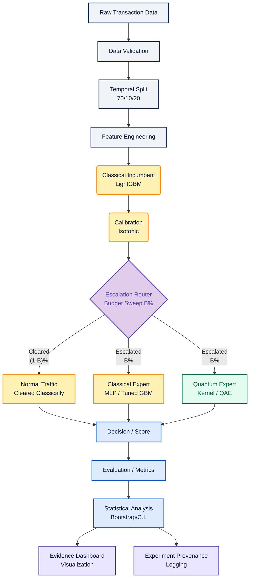

# System Architecture

The project explicitly separates the pipeline into deterministic stages to guarantee reproducibility, prevent temporal data leakage, and ensure an apples-to-apples comparison between the Classical Expert and the Quantum Expert.

## Architecture Flow

## Module Separation

1.  **Data:** `src/data/` (Acquisition, temporal splitting, validation)
2.  **Preprocessing:** `src/features/` (Engineering, scaling, reduction)
3.  **Classical ML:** `src/models/classical/` (LightGBM, Calibration, Baseline)
4.  **Routing:** `src/models/router/` (Uncertainty thresholding, budget sweeps)
5.  **Quantum ML:** `src/models/quantum/` (Kernels, QAE, PennyLane/Qiskit)
6.  **Controls:** (Implemented alongside Quantum ML for identical evaluation)
7.  **Evaluation:** `src/evaluation/` (AUPRC, C.I., Geometric difference)
8.  **Statistics:** `src/stats/` (Bootstrapping, significance)
9.  **Visualization & UI:** `src/dashboard/` (Streamlit/React for frontend)
10. **Experiment Provenance:** `src/tracking/` (MLflow or custom JSON schema for seeds, versions, config)
