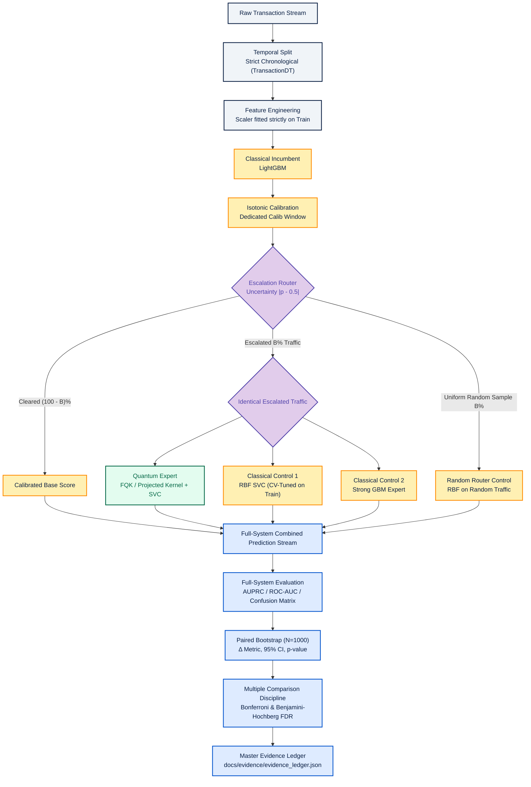

# System Architecture

The project strictly separates the pipeline into deterministic stages to guarantee reproducibility, prevent temporal data leakage, and ensure a rigorous, fair apples-to-apples comparison between Classical Experts and Quantum Experts under identical selective routing budgets.

## 1. End-to-End Scientific Architecture

## 2. Directory and Module Organization

1.  **Data Ingestion & Splitting (`src/data/`):**
    *   `generate_synthetic.py`: Deterministic synthetic generator matching IEEE-CIS tabular schema.
    *   `make_dataset.py`: Kaggle API acquisition interface and strict chronological temporal splitter.
2.  **Feature Pipeline (`src/features/`):**
    *   `build_features.py`: `StandardScaler` fitted exclusively on historical training data to eliminate test set contamination.
3.  **Base Classical Model (`src/models/classical/`):**
    *   `train_baseline.py`: LightGBM base classifier with Isotonic probability calibration.
4.  **Escalation Router (`src/models/router/`):**
    *   `escalation_router.py`: Quantifies boundary uncertainty $|p - 0.5|$, routes top $B\%$ ambiguous traffic, implements random-routing control baseline.
5.  **Specialist Experts (`src/models/experts/`):**
    *   `quantum_expert.py`: Quantum Expert using PennyLane exact fidelity kernel or 1-qubit Pauli expectation projected kernel (PQK) + scikit-learn `SVC(kernel='precomputed')`.
    *   `classical_rbf_expert.py`: Classical `SVC(kernel='rbf')` with automated 3-fold cross-validation tuning strictly on training escalated traffic.
    *   `classical_gbm_expert.py`: Strong non-linear `LGBMClassifier` trained specifically on ambiguous boundary transactions.
6.  **Quantum Kernel Mechanics (`src/models/quantum/`):**
    *   `feature_encoding.py`: Arctan angle scaling into $[-\pi, \pi]$ and $N$-qubit entangling circuits.
    *   `projected_kernel.py`: Statevector overlap computation and 1-qubit reduced Pauli expectation extraction.
7.  **Scientific Evaluation & Statistical Audit (`src/evaluation/`):**
    *   `system_evaluator.py`: Complete full-system evaluation across budgets $B \in \{0.5, 1, 2, 5, 10\}\%$, 1,000 paired bootstrap iterations, and FDR / Bonferroni multiple testing corrections.
    *   `router_audit.py`: Independent router audit (covariate shift KS-tests, feature dominance, uncertainty vs fraud correlation, future information checks).
    *   `temporal_robustness.py`: Compares chronological evaluation vs random IID evaluation to quantify temporal leakage inflation.
    *   `kernel_diagnostics.py`: Computes PSD eigenvalues, condition number, effective rank, and Kernel-Target Alignment (KTA).
    *   `evidence_ledger.py`: Master ledger compiler enforcing claim-to-artifact mapping.

## 3. Strict Scientific Controls Enforced

*   **Identical Escalation Slices:** Every expert evaluates the exact same transaction IDs under each budget.
*   **Leakage Firewall:** Feature scalers, baseline models, and expert hyperparameters are fitted strictly inside chronological training boundaries.
*   **Paired Bootstrap:** Bootstrap iterations draw identical sample index permutations for all competing models.
*   **No Cherry-Picking:** All 5 budgets are evaluated and reported in tabular evidence ledgers.
